<script setup>
import { VTCodeGroup, VTCodeGroupTab } from '../../.vitepress/theme/vue-theme-src'
import RandomKey from './RandomKey.vue'
</script>

# 1Panel 快速部署{#1panel-quick-deploy}

::::tip 1Panel面板

1Panel 提供直观易用的 Web 管理界面，让用户轻松掌控 Linux 服务器——无论是智能体、大模型、网站、数据库、容器、文件，还是计划任务，一切尽在指尖。

[安装 1Panel 面板](https://1panel.cn/)
::::

 根据教程完成 1Panel 面板部署后，进入 1Panel 面板，以进行后续安装步骤。

 
 ## 前置
 
 在面板应用商店安装`MySQL`数据库以及`Go`运行环境

 教程链接：[1Panel 面板安装 MySQL 数据库](https://1panel.cn/docs/v2/user_manual/appstore/mysql/)

 不必担心，安装过程中如果没有安装也会有提示。


 ## 创建项目目录 {#create-project-dir}

 在你勇于部署项目的目录下创建一个项目目录，如 `/projects/www/xtpms`

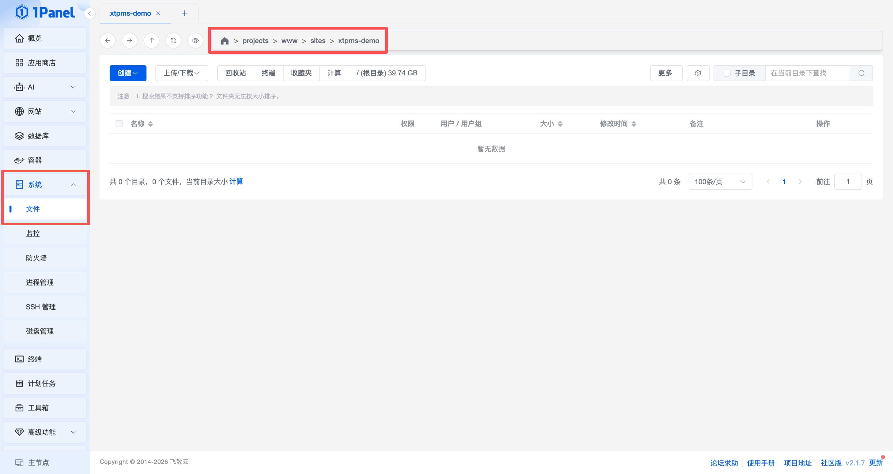

 ## 下载 Xt-PMS 发行包 {#download-xt-pms-package}

 在项目目录下，点击工具栏的`终端`，复制粘贴执行以下命令下载 Xt-PMS 发行包

 ```bash
TAG=$(curl -fsSL https://gitee.com/api/v5/repos/kamyang-tech/xt-pms/releases/latest | grep -Po '"tag_name":\s*"\K[^"]+') && curl -fLO "https://gitee.com/kamyang-tech/xt-pms/releases/download/${TAG}/xt-pms-${TAG#v}-linux-amd64.tar.gz"
```

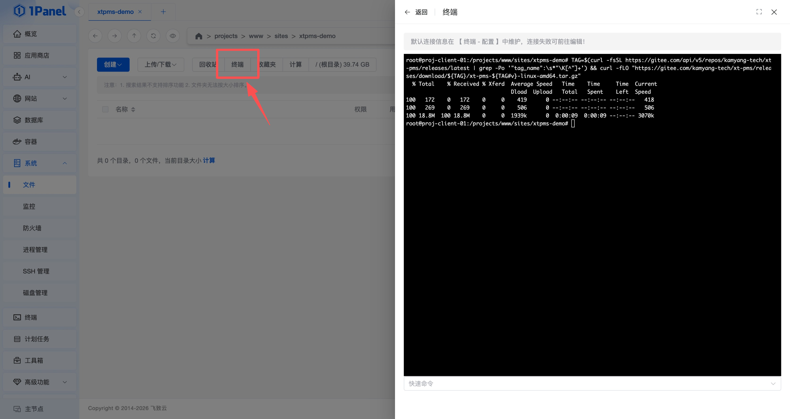

等待如图所示命令完成即下载成功。

 ## 解压发行包 {#unzip-package}

 关闭终端，右键项目发行包（压缩包），选择`解压`，直接点击`确定`解压到项目目录下。

 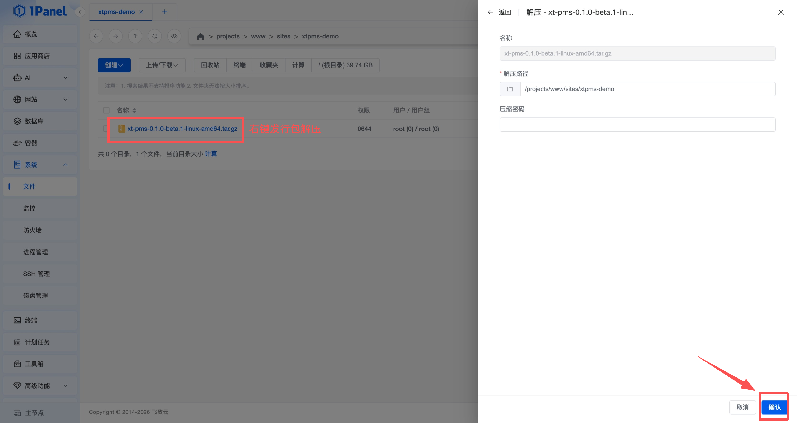

 解压完成如图

 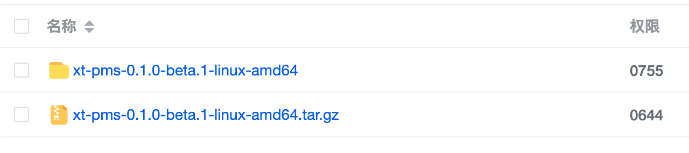

  ## 创建数据库 {#create-database}

 在 1Panel 面板`数据库`菜单下，创建一个`MySQL`数据库，如 `xtpms`

  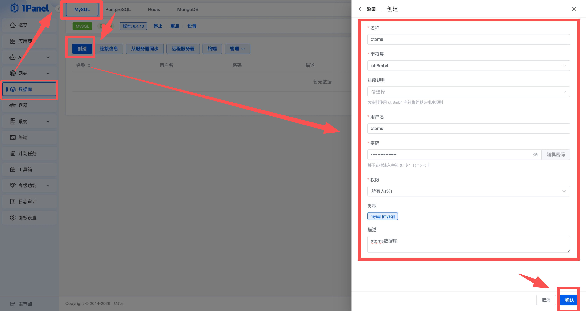

 > 注意：1Panel 面板下，MySQL数据库的连接地址是安装数据库时的`容器名称`而不是ip地址，不清楚的可以在 MySQL 菜单栏的`连接信息`查看对应的`容器连接地址`。

 ## 创建 Go 项目并启动 {#create-go-project-and-start}

 1Panel 面板左侧菜单选择`网站`，选择`运行环境`，选择`Go`，点击`创建`，创建一个 Go 项目。

::::info  项目信息填写

项目名称：`xt-pms` （可以自定义）

应用：`go` `1.26`

运行目录：`选择第一步创建项目目录里面的解压后的发行包文件夹`，参考[解压发行包](#unzip-package)

容器名称：`xt-pms` （可以自定义）

端口：`9898` `9898`  

::::

> 容器端口是9898，外部映射端口可以自定义，这个`外部映射端口`就是你的访问端口

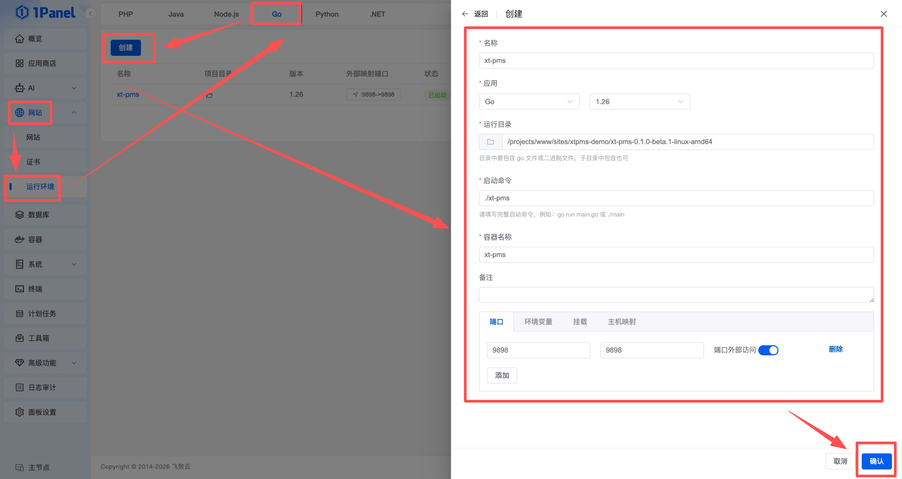

 ## 打开安装引导 {#open-install-guide}

 访问 `http://你的ip:你的端口` 打开安装引导页面，例如 `http://192.168.1.100:9898`

 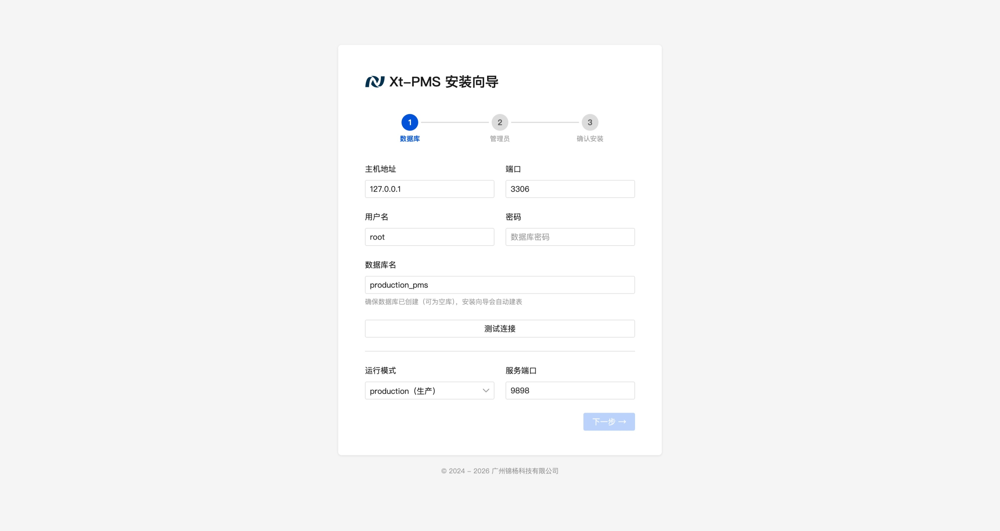

 ## 填写安装信息 {#fill-install-info}

::::info 数据库部分
 
 主机地址：`你的MySQL数据库容器名称`，例如 `mysql`，参考[创建数据库](#create-database)

 端口：`3306`

 用户名：`前面设置的数据库用户名`，例如 `xtpms`

 密码：`前面设置的数据库密码`，例如 `123456789`

 数据库名：`前面设置的数据库名称`，例如 `xtpms`

::::

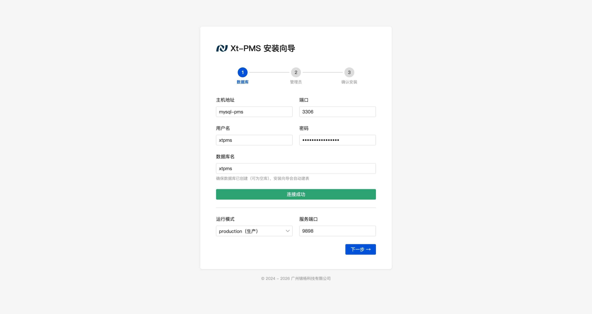

点击测试连接提示`连接成功`即为通过，可以点击下一步

::::info 管理员部分
 
管理员账号、密码、名称为`必填`，剩下的根据需要填写即可，后期可在系统设置更改。

::::

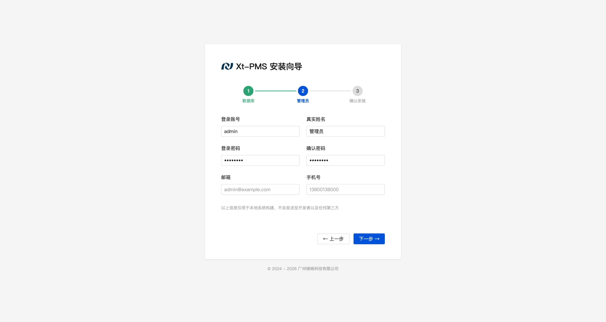

第三部直接`确认安装`即可

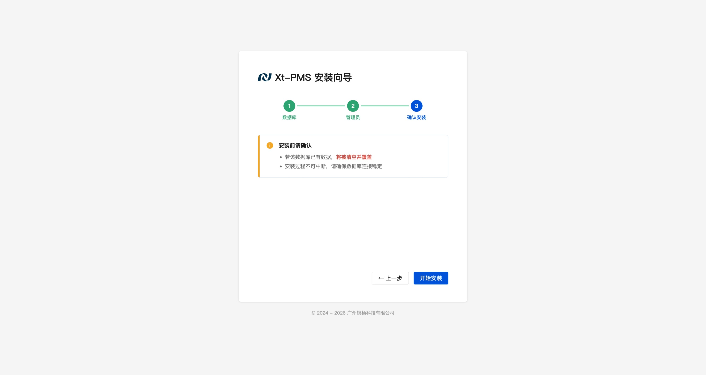

 ## 安装完成 {#install-complete}

 安装完成会自动重启并进入系统，根据设置的登陆账号密码登录系统。

 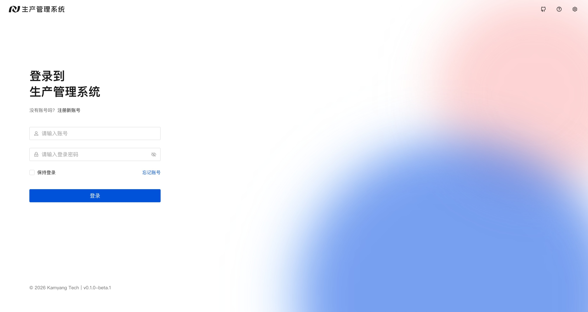


 ::::info 提示

遇到访问不了的情况请留意服务器端口是否开放，以及防火墙是否放行。

更多问题请前往 [常见问题](/faq/faq) 查看。

仍未解决请 [寻求帮助](/faq/faq)。
::::